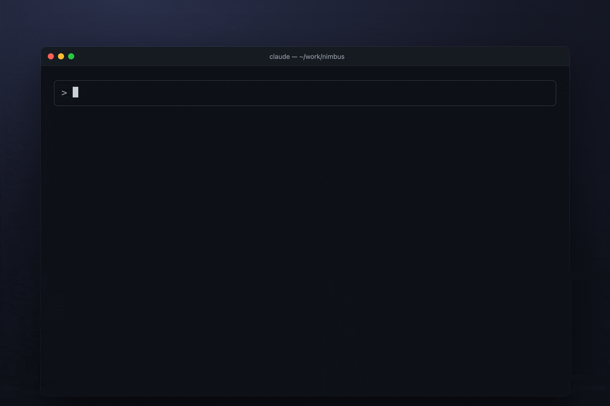
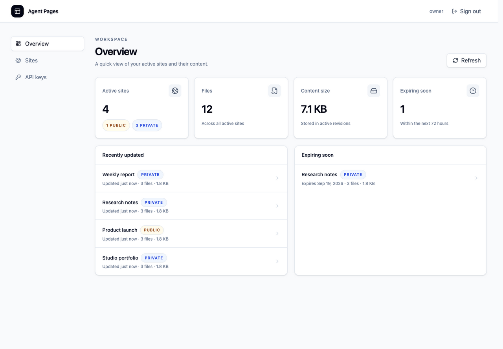
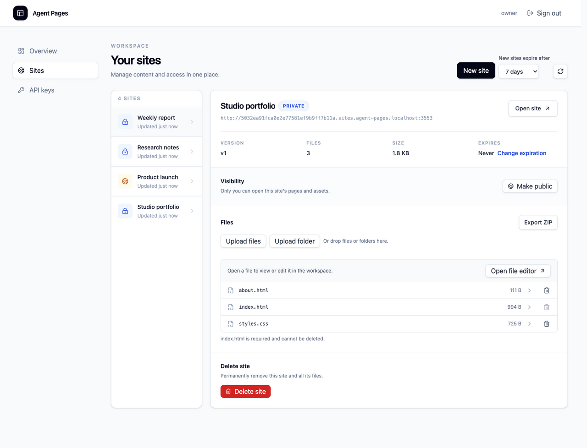
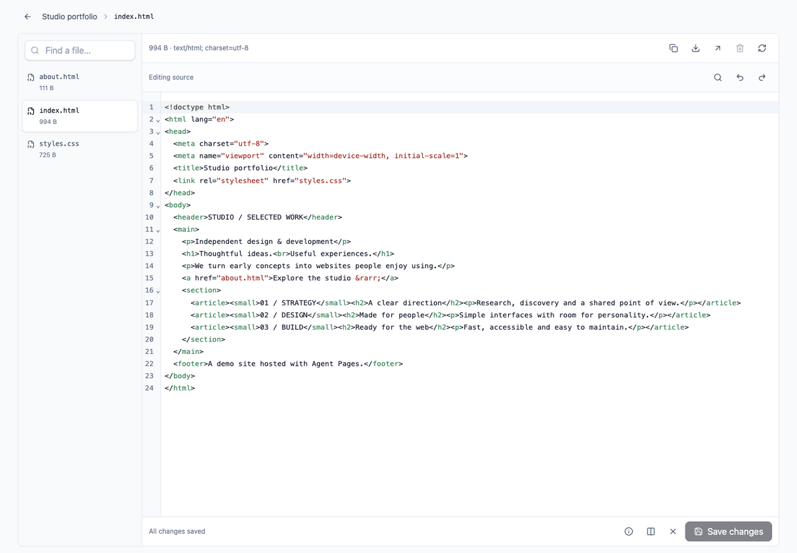
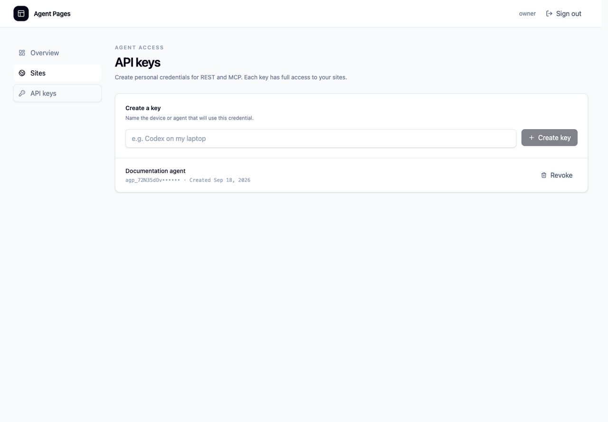
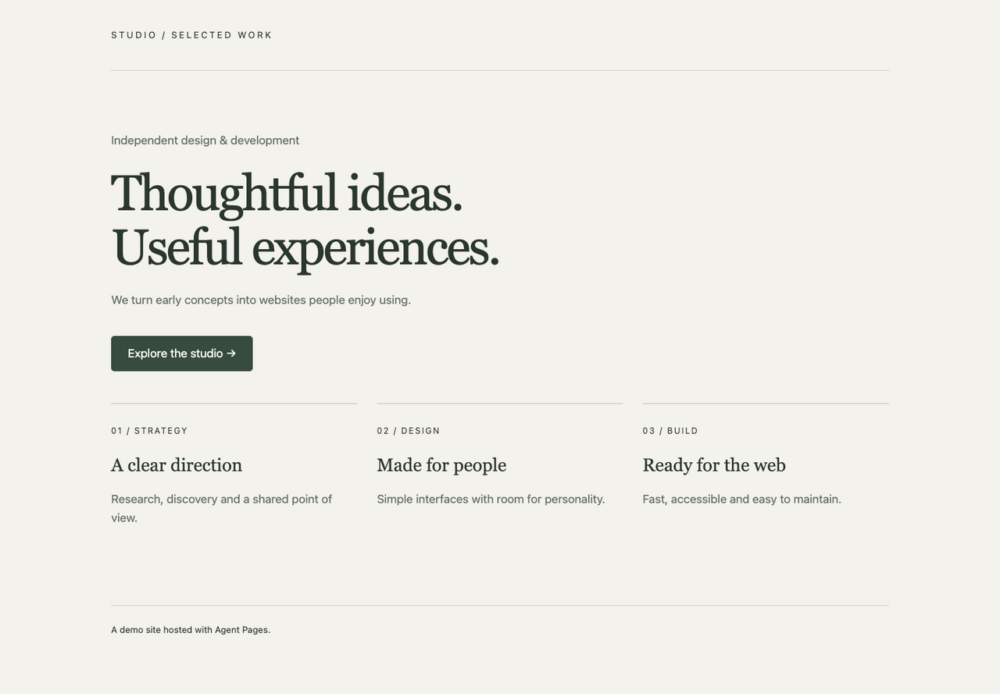

# Agent Pages

[](https://github.com/SebastianMihali/agent-pages/actions/workflows/ci.yml)
[](https://github.com/SebastianMihali/agent-pages/releases)
[](LICENSE)

Coding agents can build a report, a prototype or a landing page in minutes, but the result usually stays on localhost. Agent Pages gives them somewhere to publish it: a stable, private URL on your own server that you can open from any device and share when you choose.



<sub>A real Claude Code session against a local instance started with <code>compose.local.yaml</code>, condensed and replayed. The prompt is shortened.</sub>

[Try it locally](#try-it-locally) · [Connect an agent](#connect-an-agent) · [How it's built](#how-its-built) · [Install on a server](#install-with-docker-compose) · [Documentation](#documentation)

## Features

- **Publish from any agent.** MCP tools and a REST API work with Claude Code, Codex and other clients. A bundled skill teaches the agent the publishing workflow.
- **Private by default.** A new site is visible only to its owner until it is explicitly made public.
- **Stable URLs.** Updates publish atomically at the same address, and version checks stop two agents from silently overwriting each other.
- **Isolated origins.** Each site's code runs on its own hostname, separate from the dashboard and API.
- **Owner dashboard.** Upload files or folders, edit text in the browser, restore earlier revisions, set expirations and export a ZIP.
- **Self-hosted.** One container and one data volume on your server and domain.

## Try it locally

You can run Agent Pages on your own computer before setting up a domain. You need Git and Docker Desktop, or Docker Engine 28 or newer with Compose v2. Older Linux engines can expose ports published on `127.0.0.1` to their local network.

```sh
git clone https://github.com/SebastianMihali/agent-pages.git
cd agent-pages
docker compose -f compose.local.yaml run --rm password
docker compose -f compose.local.yaml up --build --detach
```

The first command builds the image and asks for an owner password without echoing it. Only its hash is stored, in a local Docker volume. Open `http://app.agent-pages.localhost:3000` in a browser that resolves `*.localhost` to your computer, such as Chrome or Firefox, and sign in as `owner`.

To connect an agent, create a key in **API keys** and follow the [agent setup guide](docs/agent-setup.md) using `http://app.agent-pages.localhost:3000/mcp` as the MCP URL. If the agent reports that the host cannot be found, its system resolver does not map `*.localhost` to your computer. Add `127.0.0.1 app.agent-pages.localhost` to your hosts file; an IP address in the URL itself is rejected.

This instance uses development HTTP and listens only on `127.0.0.1`, so its sites, including public ones, are reachable only from this computer. Stop it with `docker compose -f compose.local.yaml down`. Add `--volumes` to delete its sites and password. For a real installation, follow [Install with Docker Compose](#install-with-docker-compose).

## Connect an agent

The application includes an MCP server at `https://app.example.com/mcp` and a bearer-authenticated REST API at `https://app.example.com/api`. Create a dedicated API key in the dashboard and supply it through the agent process environment as `AGENT_PAGES_API_KEY`.

```sh
npx skills add https://github.com/SebastianMihali/agent-pages.git
```

Follow [Agent setup](docs/agent-setup.md) to configure MCP or REST and copy a ready-to-use instruction for your agent. See [REST API](docs/api.md) for endpoints, payloads, uploads and retry rules. Keep credentials out of prompts and uploaded site files.

## How it works

1. **Create a site.** Upload static files or a folder containing a root `index.html` from the dashboard, or let an agent create it through MCP or REST. Every new site starts private and receives a stable URL.
2. **Review the result.** Choose **Open site** to view it, or inspect its files in the dashboard. Uploaded pages run on a separate origin from the owner workspace.
3. **Update in place.** Upload changed files, save an edit in the file workspace, or ask your agent to publish an update. Complete revisions become active atomically; the site's URL and visibility are preserved. Version checks prevent silently overwriting a concurrent update.
4. **Control access and lifetime.** Keep the site private or explicitly make it public. Set or remove its expiration while it is live, export its files, or delete it when finished.

Sites start private to their owner. New sites inherit the owner's expiration preset unless creation supplies an explicit expiration, and a live site's expiration can be changed later. An explicit visibility change makes a site public, and it can be made private again. The application and each site's uploaded code run on separate browser origins. Owners can inspect and restore bounded revision history through the dashboard, REST and MCP. Private sharing, multiple accounts, ZIP imports and SPA fallback are outside this MVP.

## How it's built

Agent Pages treats everything an agent uploads as untrusted and every network response as something that can be lost. The [architecture guide](docs/architecture.md) records each decision and its trade-offs.

- **One domain module, three transports.** REST, MCP and the dashboard adapt the same site operations, so version checks, quotas and receipts behave identically everywhere.
- **Atomic publication.** Each change prepares a complete immutable revision and activates it in one SQLite transaction. Visitors never see a partial batch, and startup recovers interrupted work before reporting ready.
- **Safe retries.** Every mutation carries a caller-generated operation ID. Retrying after a lost response returns the original result instead of publishing twice.
- **Origin isolation.** Uploaded HTML and JavaScript run on a per-site hostname. Private sites are opened through a one-use ticket, so management credentials never reach hosted pages.
- **Tested at the boundaries.** Tests run against real SQLite databases and file trees, simulate crashes in child processes, and exercise security boundaries in Chromium and Firefox over HTTPS.

## Visual tour

The owner dashboard brings active sites, public/private visibility, file totals and upcoming expirations into one workspace.



These are screenshots of the running application with disposable demo data. The local addresses are examples, and the API key screen shows only a masked prefix.

<details>
<summary><strong>Manage a site: files, visibility, expiration and ZIP export</strong></summary>

Select a site to see its stable URL, current version and files. Upload files or a folder, change its expiration, explicitly make it public, or export its active content as a ZIP.



</details>

<details>
<summary><strong>Inspect and edit source in the file workspace</strong></summary>

Open a file from the site detail, then choose **Edit file** to modify supported text. **Save changes** publishes immediately at the existing URL. HTML is displayed as source; **Open page** opens the rendered content on its separate site origin.



</details>

<details>
<summary><strong>Connect coding agents through API keys</strong></summary>

Create a labeled key for each agent client and use it with MCP or REST. The full key is shown only once; the dashboard lets you revoke it later. Each key has the owner's site-management permissions. See the [agent setup guide](docs/agent-setup.md) for configuration.



</details>

<details>
<summary><strong>Open the hosted result</strong></summary>

Visitors see the uploaded website on its own origin. This example is demo content hosted by Agent Pages, not a built-in template or part of the dashboard. Private sites require the owner's authenticated access; explicitly public sites can be viewed without signing in.



</details>

## Install with Docker Compose

The installation below builds from source using the checked-in `Dockerfile` and `compose.yaml`. You need Git, a server with Docker Engine, and Docker Compose **2.30 or newer**. Compose's [`env_file.format: raw`](https://docs.docker.com/reference/compose-file/services/#format) preserves the dollar signs in the password hash. Node and pnpm are supplied by the container build.

### 1. Prepare DNS and HTTPS

Choose two separate hostnames and point their DNS records at your reverse proxy:

| DNS name | Purpose |
| --- | --- |
| `app.example.com` | Dashboard, login, REST and MCP |
| `*.sites.example.com` | Isolated hostnames for uploaded sites |

Replace these examples with your own domain. Configure HTTPS for the application host and a wildcard certificate for `*.sites.example.com`. Wildcard issuance requires DNS-01; the [DNS and certificate guide](docs/operations.md#dns-and-certificates) explains DNS-01 and the required proxy routes. The rest of your domain can continue serving other projects.

### 2. Get the source and create the owner credentials

Clone the repository, then work from its root:

```sh
git clone https://github.com/SebastianMihali/agent-pages.git
cd agent-pages
cp .env.example .env.production
chmod 600 .env.production
```

Generate the password hash interactively using the helper in a temporary Node container:

```sh
docker run --rm -it \
  --mount "type=bind,source=$PWD,target=/workspace,readonly" \
  --workdir /workspace \
  node:24.16.0-bookworm-slim \
  node scripts/password-hash.ts
```

Enter and confirm your chosen password; input is hidden. Copy the printed hash into `.env.production`. If you already have Node 24.16 installed, you can instead run `node scripts/password-hash.ts` directly.

Edit `.env.production` to contain your production values:

```dotenv
NODE_ENV=production
APP_ORIGIN=https://app.example.com
CONTENT_BASE_DOMAIN=sites.example.com
DATA_DIR=/data
ADMIN_USERNAME=owner
ADMIN_PASSWORD_HASH=<paste the generated scrypt hash here>
PORT=3000
```

`CONTENT_BASE_DOMAIN` is a hostname without `https://` or `*.`. Paste the hash as an unquoted value, preserving every `$` character. Keep the file private and untracked. Optional storage, file-size and request limits are listed in `.env.example`.

### 3. Build and start

```sh
docker compose config --quiet
docker compose up --build --detach
docker compose ps
curl --fail http://127.0.0.1:3000/health/ready
```

Readiness returns `{"status":"ok"}` after initialization and storage recovery. If it does not become ready, inspect `docker compose logs --tail=100 agent-pages` before proceeding.

Compose runs one instance, binds port 3000 to the server's loopback interface and persists data in the `agent-pages-data` named volume mounted at `/data`. Keep one replica and local persistent storage. For a bind mount instead, the directory must be writable by container UID/GID `1000`.

### 4. Connect the reverse proxy and sign in

Route both the application hostname and the wildcard content hostnames to this same application. A proxy running on the host can use `http://127.0.0.1:3000`; a containerized proxy needs a shared Docker network and the application's container port `3000`. Its own `127.0.0.1` does not address the application container.

Preserve the external `Host`, replace forwarded host/protocol headers, force HTTPS and disable proxy caching. Allow at least the configured multipart body limit, including framing, and 120 seconds for browser uploads. Follow the [reverse-proxy requirements](docs/operations.md#reverse-proxy).

```sh
curl --fail https://app.example.com/health/ready
```

Open your application URL and sign in with `ADMIN_USERNAME` and the original password. Create a private site containing `index.html`, then open it from the dashboard to verify wildcard routing and TLS. In **API keys**, create a key for your agent and follow the [agent setup guide](docs/agent-setup.md).

To stop the installation while retaining its data, use `docker compose down`. The `--volumes` option deletes the persistent volume, so omit it when stopping or updating. Take a [cold backup](docs/operations.md#cold-backup) before upgrades.

## Run locally for development

From the repository root, use Node 24.16 and pnpm 11.5.0 (exact dependency versions are pinned). This starts the development server with isolated local data; use the Docker instructions above for a production installation.

```sh
pnpm install --frozen-lockfile
cp .env.example .env
pnpm admin:password-hash
```

The last command reads a password privately and prints its salted hash. Set `ADMIN_PASSWORD_HASH` in `.env` to that complete value, retaining the dollar signs, and choose `ADMIN_USERNAME`. The example uses isolated local development storage and distinct `.localhost` hosts.

```sh
pnpm dev
```

Open `http://app.agent-pages.localhost:3000` and sign in. The dashboard lets you create a private site from selected files or a folder, publish files to an existing site and delete individual files. Create a labeled API key for each agent client, then follow the [agent setup guide](docs/agent-setup.md) to install the skill and connect through MCP or REST. The web interface also lists sites, opens private content and manages expiration, visibility and keys.

Production requires HTTPS, an application hostname and a wildcard on one delegated content subdomain such as `sites.example.com`; the rest of a shared domain stays untouched, and the wildcard certificate needs the DNS-01 challenge. See [development and validation](docs/development.md) and [container, proxy and backup operations](docs/operations.md). Production data belongs on one local persistent volume with one application process.

## Documentation

- [Installation, proxy and backup operations](docs/operations.md)
- [Agent and skill setup](docs/agent-setup.md)
- [Owner dashboard: editing, revisions, export and deletion](docs/dashboard.md)
- [REST API reference](docs/api.md)
- [Development, tests and release publishing](docs/development.md)
- [Architecture](docs/architecture.md) and [domain glossary](CONTEXT.md)
- [Agent Pages skill](skills/agent-pages/SKILL.md)

## Author

Agent Pages is built by [Sebastian Mihali](https://sebastianmihali.com). I build MCP servers and tooling for coding agents, and I'm available for contract work. You can reach me through [sebastianmihali.com](https://sebastianmihali.com).

Built with Claude Code. I designed the architecture and security boundaries and reviewed every change.

## License

Agent Pages is released under the [MIT License](LICENSE).
